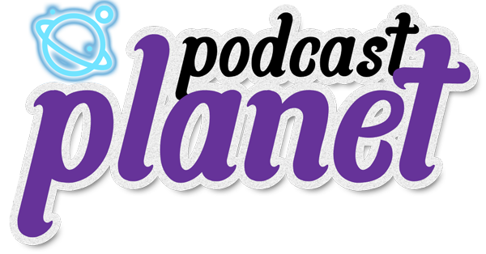

# Podcast Planet: Capstone Project

This podcast web application enables users to explore a variety of shows and episodes organized by seasons. Users can easily navigate between seasons, listen to episodes, and mark favorites. The app provides preview images, genres, and last updated information for discovering new content. Features include arranging shows and favorites, filtering by title, and a persistent audio player.

## Features

- [x] Global podcast streaming with placeholder music.
- [x] Detailed information display for each podcast.
- [x] Favorite functionality to easily access and manage your preferred podcasts.
- [x] Additional smaller features to enhance usability and user experience.

## Technologies and Hooks Used

This project incorporates a variety of technologies and concepts to enhance its functionality and user experience:

- React: JavaScript library for building user interfaces.
- Redux: A state management library that enables efficient management of the audio player state.
- React Slick: A popular carousel component for React, utilized to create a sliding carousel of recommended shows on the landing page.
- useState: A React Hook that allows for state management within functional components, employed for managing various component-level states.
- useEffect: Another React Hook used to perform side effects in functional components, enabling actions such as fetching data, handling subscriptions, and more.
- useRef: A React Hook used to reference elements or values, enabling efficient manipulation or access to those references.

Throughout the project, these technologies and concepts are employed to enhance the user interface, achieve efficient state management of the audio player using Redux, create an interactive sliding carousel using React Slick, and leverage the power of React Hooks such as useState, useEffect, and useRef for managing component-level states, performing side effects, and accessing references.

## OG Meta Tags

My OG meta tags used in this project were tested using [https://metatags.io/](https://metatags.io/). A useful tool for generating and previewing Open Graph (OG) meta tags that improve how your website appears when shared on social media platforms.

## Setup & How to use

1. Clone the repo with:
   `git clone <repository-url>`

2. Navigate to the project directory:
   `cd podcast-project`

3. Install the dependencies with npm or yarn:
   `npm install`
   OR
   `yarn install`

4. Start the dev server:
   `npm run dev`
   OR
   `yarn dev`

Click on the `http://localhost` link in your terminal after successful startup to see the running app in your browser.
Make sure you have Node.js installed on your machine.
Note: This project uses **Vite** as the build tool, which provides a fast development server and optimized builds.
 
Alternatively, see the App live and online: [https://capstone-podcast-project.netlify.app/](https://capstone-podcast-project.netlify.app)

<!--
## User Stories

**There is a total of 50 possible stories below that determine my final grade/marks.**

Each completed story that is verified by my lecturer will result in me receiving 2% towards my final mark. Completing all 50 will result in a mark of 100%.

---

- [x] Project is deployed to a custom Netlify URL. Found under repo About section
- [ ] All views in the app display correct on the smallest mobile devices available “Iphone SE”. This can be emulated in Chrome Dev tools.
- [x] All favicon information has been created an added correctly via [https://realfavicongenerator.net/](https://realfavicongenerator.net/) (you are welcome to use any free PNG image you find on [https://www.flaticon.com/](https://www.flaticon.com/))
- [x] All metatag information has been creataed and added via [https://metatags.io/](https://metatags.io/) (You are welcome to use any free image you find on [https://unsplash.com/](https://unsplash.com/)). Be mindful to manually replace all URL values (especially image URL) to absolute Netlify URL values (you will need to deploy to Netlify first)

---

- [x] All show data loaded via a `fetch` call from the `https://podcast-api.netlify.app/shows`
- [x] All data is loaded a `fetch` and no endpoint-specific data is hardcoded
- [x] When viewing a specific show data is loaded via `fetch` from individual show endpoint
- [x] There is a loading state while initial data is being loaded
- [x] There is a loading state while new data is being loaded

---

- [x] User sees the name of all available shows on the platform
- [x] User sees shows broken down into seasons, sorted by number
- [x] User has a way to listen to any episode in a season for a show
- [x] User is able to see a view where only episodes for a specific selected season is shown
- [x] User is able to toggle between different seasons for the same show

---

- [x] User sees preview image of shows when browsing
- [x] User sees the amount of season as number in a show when browsing
- [x] User sees a human-readable date to when a show was last updated
- [x] User sees what genres (as genre titles) a show is associated with when browsing

---

- [x] User sees a preview image of seasons for specific show
- [x] User sees the amount of episodes as number for a season
- [x] User is able to go back to a show view from an season-specific view

---

- [x] User is able to mark specific episodes as favourites so that they can find them again
- [x] User can visit a view where they see all their favourites
- [x] User is able to see the associated show and season when episode in favourite
- [ ] Related by season/show epsiodes are grouped together in favourites
- [x] User is able able to remove episodes from their favourites

---

- [x] User is able to arrange list of shows based on title from A-Z
- [x] User is able to arrange list of shows based on title from Z-A
- [x] User is able to arrange list of showing the most recent updated
- [x] User is able to arrange list of shows from least recent updated
- [x] User is able to filter shows based on title by means of a text input
- [ ] User is able to find shows based on fuzzy matching of concepts (you can use something like [https://fusejs.io/](https://fusejs.io/))

---

- [x] User sees the date and time that I added something as a favourite
- [x] User is able to arrange favourites based on title from A-Z
- [x] User is able to arrange favourites based on title from Z-A
- [x] User is able to arrange favourites starting with the most recent updated
- [x] User is able to arrange favourites starting with the furthest back updated

---

- [x] Audio player is always visible so that user can listen to episodes while I browse
- [x] User receives a notification that confirms they want to close the page when audio is playing
- [ ] App remembers what shows and episode user listened to last when returning to the platform
- [ ] Automatically filters shows by a genre if the genre label is clicked on
- [ ] App remembers and shows what episodes user listened all the way through
- [ ] App remembers the exact timestamp where user stopped listening within a 10 seconds accuracy of closing
- [ ] App remembers and shows the exact timestamp location of where I left off any episode
- [ ] User has the option to "reset" all their progress, effectively removing their listening history

---

- [x] User is presented with a sliding carousel of possible shows they might be interested in on the landing page
- [ ] User is able to log in via [https://app.supabase.com](https://app.supabase.com/) authentication
- [ ] User favourites are stored in [https://app.supabase.com](https://app.supabase.com/) database
- [ ] User favourites are automatically synced when logged in, ensuring that they share favourites between devices
- [ ] Users are able to share their favourites as a publicly accessible URL -->
